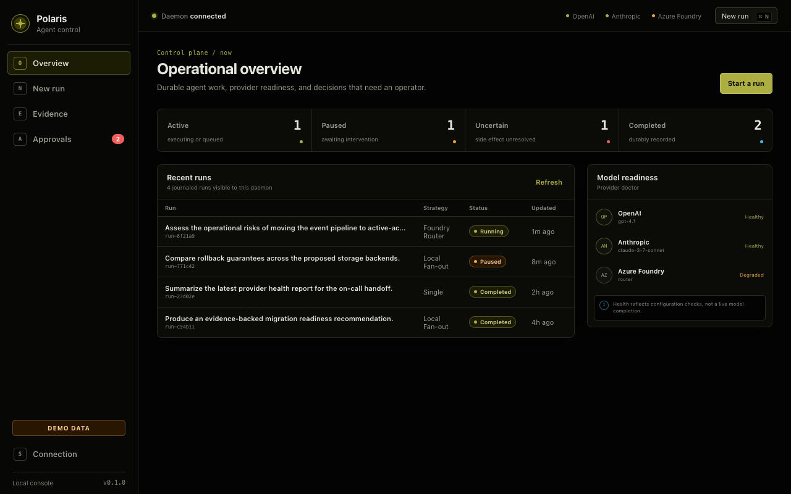
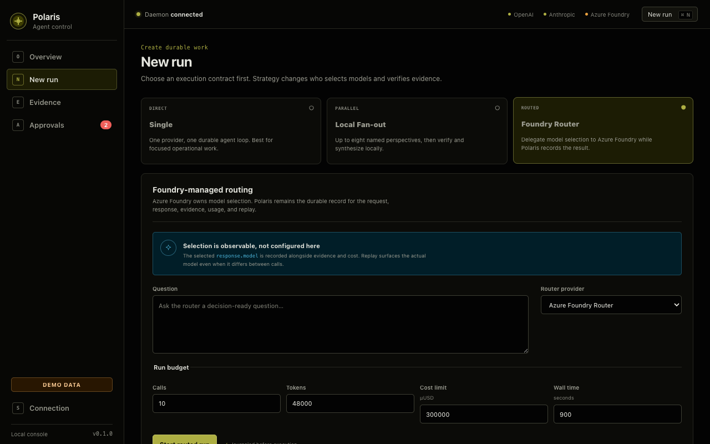

# Polaris Agent

**Keep local and routed agent work recoverable, inspectable, and under operator control when the process disappears.**

[](https://github.com/hyeonsangjeon/polaris-agent/actions/workflows/ci.yml)
[](https://github.com/hyeonsangjeon/polaris-agent/actions/workflows/codeql.yml)
[](https://www.python.org/)
[](LICENSE)
[](#alpha-limitations)



Polaris is a local-first Python runtime (`polaris`, `polarisd`) with an independent
Tauri macOS operator console. It runs one agent, a bounded local Ollama fan-out, or
a thin Microsoft Foundry Model Router strategy while keeping a SQLite journal,
evidence artifacts, budgets, approvals, and deterministic replay.

> **Alpha:** use a disposable workspace first. Polaris deliberately stops when an
> opaque side effect may have happened but cannot be proven.

[한국어 요약과 빠른 시작 →](docs/korean/README.md)

## The 30-second story

1. Start **K Ollama workers** with different roles.
2. Kill the daemon during the run.
3. Restart it: committed work stays committed, active leases are respected, and
   only expired recoverable work resumes.
4. The verifier preserves disagreements instead of hiding them.
5. Optionally send resolution work through a Foundry `model-router` deployment;
   Foundry—not Polaris—chooses and fails over between underlying models.
6. Replay the completed record and hashed artifacts without calling a model again.

This is a failure-semantics story, not a claim that live web research finishes in
30 seconds.

## Why not another agent framework?

Polaris is intentionally narrower than a general orchestration SDK. Choose it when
the behavior after interruption matters as much as the happy path.

| Behavior | Typical in-memory loop | Polaris |
|---|---|---|
| Process death | Restart the whole request | Journal steps, reclaim expired leases, resume eligible work |
| Ambiguous write | Often retry or fail | Reconcile when supported; otherwise pause for a person |
| Multi-worker result | Collect text | Validate evidence, record disagreement, emit hashed artifacts |
| Model routing | Application selects a model | Local fan-out is explicit; Foundry Router delegates selection to its deployment |
| Audit | Logs | Runs, events, calls, approvals, budgets, receipts, and artifacts |
| Revisit result | Rerun providers/tools | Replay committed records without execution |

Polaris can sit beside an existing framework: it is not trying to replace every
prompt graph, SDK, or hosted control plane.

## Three-minute Ollama quickstart

Prerequisites: Python 3.11+, [uv](https://docs.astral.sh/uv/), and
[Ollama](https://ollama.com/) listening on `127.0.0.1:11434`.

```bash
git clone https://github.com/hyeonsangjeon/polaris-agent.git
cd polaris-agent
uv sync --dev
ollama pull llama3.2
uv run polaris setup --root "$PWD"
```

`setup` creates a private API token and defaults to `llama3.2` at
`http://127.0.0.1:11434`. Keep this next command running in **terminal 1**:

```bash
uv run polarisd
```

The foreground daemon stops when that terminal closes. On macOS, install it as a
launchd user service instead with `uv run polaris daemon install`, then
`uv run polaris daemon start`. LaunchAgent installation is supported only when
providers do not use `api_key_env`: launchd does not inherit shell API-key
variables, and Polaris never copies secrets into its plist. Run API-key providers
in the foreground, or use Ollama, Entra/Managed Identity, or a future secure
credential integration.

In **terminal 2**:

```bash
uv run polaris doctor
uv run polaris run "Write a short inventory of this repository." \
  --provider ollama --call-limit 8 --token-limit 12000 --wait
uv run polaris runs
```

Read-only tools are auto-approved. Writes and shell commands pause by default.
The desktop console shows pending decisions; the API also exposes
`GET /v1/runs/{run_id}/approvals?pending=true`. Approve only after checking the
arguments. A `--wait` client remains attached while the run is paused, so use a
third terminal (or the desktop) to inspect and decide:

```bash
uv run polaris runs --status paused
RUN_ID=run_REPLACE_ME
TOKEN="$(cat "$HOME/.local/share/polaris/api-token")"
curl -fsS -H "Authorization: Bearer $TOKEN" \
  "http://127.0.0.1:8765/v1/runs/$RUN_ID/approvals?pending=true"
uv run polaris approve APPROVAL_ID --reason "Reviewed path and command"
# or
uv run polaris deny APPROVAL_ID --reason "Outside the intended workspace"
```

Run local fan-out with the same Ollama provider:

```bash
uv run polaris run "Compare the durability risks in this repository." \
  --mode fan-out \
  --worker ollama:recovery --worker ollama:security --worker ollama:operations \
  --verifier ollama --synthesizer ollama \
  --call-limit 24 --token-limit 32000 --wait
```

The K workers are concurrent tasks in the Polaris engine. Ollama remains the model
server; Polaris does not claim Ollama itself provides fan-out orchestration.

See [Ollama configuration and probes](docs/providers/ollama.md) and the
[fan-out example](examples/fanout/README.md).

## Foundry Model Router quickstart

Deploy a Microsoft Foundry model router first. Routing mode
(`Balanced`, `Cost`, or `Quality`) and the allowed model subset are **deployment
settings**, not Polaris settings. The smallest model in the subset limits the
effective context window.

API-key configuration:

```json
{
  "kind": "foundry_router",
  "model": "model-router",
  "base_url": "https://YOUR-RESOURCE.services.ai.azure.com/openai/v1",
  "api_key_env": "AZURE_FOUNDRY_API_KEY",
  "api_mode": "responses",
  "azure_auth": "api_key"
}
```

Entra configuration:

```json
{
  "kind": "foundry_router",
  "model": "model-router",
  "base_url": "https://YOUR-RESOURCE.services.ai.azure.com/openai/v1",
  "api_mode": "responses",
  "azure_auth": "entra",
  "entra_scope": "https://ai.azure.com/.default"
}
```

Use the complete examples. First replace their absolute path and resource
placeholders as described in [`examples/README.md`](examples/README.md). Set
`POLARIS_HOME` below to the same `data_dir` used in the selected example, then
create the configured bearer-token path without changing the Foundry provider
configuration:

```bash
export POLARIS_HOME='/absolute/path/used/as/data_dir'
install -d -m 700 "$POLARIS_HOME"
POLARIS_TOKEN_FILE="$POLARIS_HOME/api-token" uv run python - <<'PY'
import os
import secrets

path = os.environ["POLARIS_TOKEN_FILE"]
fd = os.open(path, os.O_WRONLY | os.O_CREAT | os.O_EXCL, 0o600)
with os.fdopen(fd, "w", encoding="utf-8") as token_file:
    token_file.write(secrets.token_urlsafe(48) + "\n")
os.chmod(path, 0o600)
PY
```

Keep the configured daemon running in one terminal. The model secret remains only
in that foreground process's environment:

```bash
export AZURE_FOUNDRY_API_KEY='set-in-your-shell-or-secret-manager'
uv run polarisd --config examples/config.foundry-router-key.json
```

In another terminal:

```bash
uv run polaris --config examples/config.foundry-router-key.json doctor
uv run polaris --config examples/config.foundry-router-key.json run \
  "Assess these claims and preserve disagreement." \
  --mode foundry-router --provider foundry-router \
  --call-limit 8 --token-limit 24000 --wait
```

For Entra, install the existing optional extra (`uv sync --extra azure`), sign in
through a credential supported by `DefaultAzureCredential`, and use
`examples/config.foundry-router-entra.json` for both daemon and client.

Polaris sends only Responses API calls to the configured `model-router`
deployment. The deployment owns underlying selection and failover. Polaris adds
the durable journal, evidence checks, budget accounting, replay, and logging of
the actual `response.model` returned for every completed call.

- Microsoft: [Responses API model routing](https://learn.microsoft.com/azure/foundry/openai/how-to/responses-model-routing)
- Microsoft: [Model Router concepts](https://learn.microsoft.com/azure/foundry/openai/concepts/model-router)
- Polaris: [provider contract and configuration](docs/providers/foundry-model-router.md)



## Architecture

```text
CLI / independent macOS console
              │ bearer-authenticated loopback API
              ▼
      polarisd · 127.0.0.1:8765
        ├─ run service + approvals
        ├─ K-worker ensemble engine
        ├─ SQLite WAL journal
        └─ content-addressed artifacts
              │
       ┌──────┴────────┐
       ▼               ▼
 local Ollama    Foundry Responses API
 explicit K      model-router owns selection
```

Details: [architecture](docs/architecture.md) ·
[durability contract](docs/durability.md) ·
[security boundary](docs/security.md) ·
[design rationale](docs/design-rationale.md)

Docker Compose is available for NAS-adjacent deployments, but keep the SQLite
journal on local storage; see [Docker and NAS deployment](deploy/docker/README.md).

## Durability contract

Polaris resumes work according to a tool's safety class:

- **Read-only:** safe to execute again after an expired lease.
- **Idempotent:** retry only where the operation's contract makes duplicates
  equivalent.
- **Reconcilable:** inspect durable state/receipt first, then commit the observed
  result or request an approved retry.
- **Opaque side effect:** if the process died in the ambiguity window, mark it
  uncertain and stop for operator approval.

Committed steps are not executed again. Active leases are not stolen. Provider
calls may be billed twice if a response arrived but the process died before it was
committed; the journal records that warning.

**Polaris does not promise arbitrary exactly-once execution.** See
[crash windows and state machines](docs/durability.md).

## Security boundary

- The daemon binds to `127.0.0.1:8765` by default and requires a bearer token.
- A non-loopback bind requires both `--allow-remote` and a token; add trusted
  network transport controls because Polaris does not terminate TLS.
- Tool filesystem roots are explicit. Private HTTP access is off by default.
- Shell is an opaque side effect and requires approval by default.
- Provider secrets are read from named environment variables, never embedded in
  JSON examples. Backups exclude credentials and the API token.
- The Tauri console is a separate client; it does not make the daemon a sandbox.

Read the [threat model](docs/security.md) and [security policy](SECURITY.md)
before exposing the service.

## Alpha limitations

- Interfaces, journal schema, and artifact contracts may change before 1.0.
- The tested primary desktop path is macOS; the console is not the daemon.
- Recovery cannot prove the outcome of arbitrary shell commands or remote APIs.
- Provider retries can duplicate billing across a crash window.
- Model quality, tool calling, and context capacity depend on the selected local
  model or Foundry deployment.
- Fan-out is bounded to eight workers and uses fixed budget allocation.
- A CLI using `--wait` stays attached while an approval-paused run is
  non-terminal; decide from the desktop or another terminal.
- Offline mode constrains configured endpoints; it is not an OS-level network
  sandbox.
- The current functional baseline is 203 Python tests, 9 frontend tests, and 5
  Rust tests. Branch-aware Python coverage is 88.48% and enforced at 85%.

## Roadmap

- Stabilize the run/artifact schema and migration policy.
- Keep crash-window and recovery coverage above the enforced gate.
- Improve operator-facing uncertainty reconciliation and approval inspection.
- Expand signed, reproducible desktop packaging.
- Validate longer recovery drills across macOS, Linux, and NAS-adjacent hosts.

Plans are directional, not promises. See the
[D0–D30 project experiment](docs/experiments/100-stars.md) for adoption
guardrails.

## Project

- [Contributing](CONTRIBUTING.md)
- [Security policy](SECURITY.md)
- [Changelog](CHANGELOG.md)
- [Code of Conduct](CODE_OF_CONDUCT.md)
- [Citation](CITATION.cff)

Polaris is MIT licensed. Selected, attributed Hermes Agent ports are listed in
[THIRD_PARTY_NOTICES.md](THIRD_PARTY_NOTICES.md) and the
[provenance note](docs/upstream-hermes.md). Polaris uses its own name, prose,
prompts, and visual assets.
