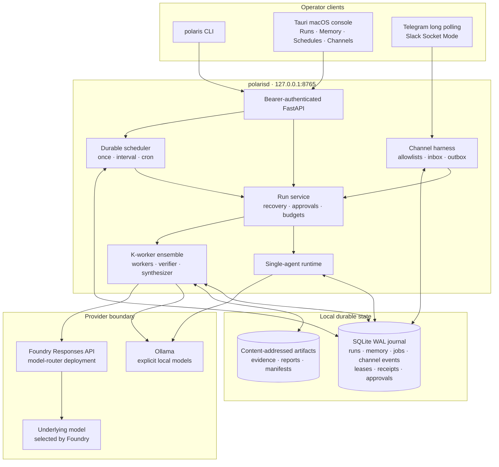
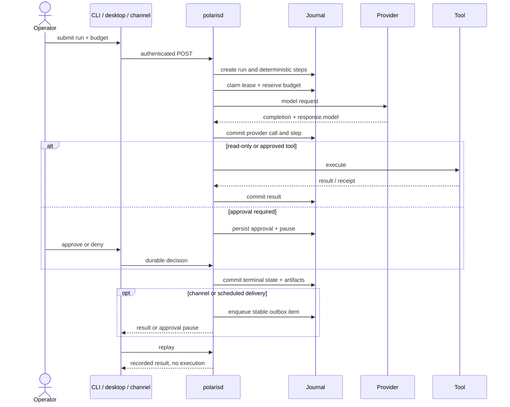

# Architecture

Polaris separates operator surfaces, durable coordination, OS capabilities, and
model providers. The Python daemon is the authority for runs, memory snapshots,
scheduled jobs, channel delivery, and approval state. The CLI and macOS Tauri
console are independent authenticated clients; Telegram and Slack are optional,
allowlisted adapters.

## Components

### Operator clients

`polaris` creates and inspects runs, submits approval decisions, resumes eligible
work, and replays committed results. The Tauri desktop application is a separate
macOS operator console with Memory, Schedules, and Channels views. Neither
client owns recovery state.

Telegram uses outbound Bot API calls plus long polling; Slack uses one
workspace's Socket Mode connection. Both apply user and conversation allowlists
before durable processing. They are private operator surfaces, not public HTTP
ingress or separate authorization domains.

### Daemon and API

`polarisd` listens on `127.0.0.1:8765` by default. Every `/v1` route requires the
setup-generated bearer token; `/health` is unauthenticated and returns only
service health. A non-loopback listener requires `--allow-remote` and a token.

The service schedules in-process tasks and, at startup:

1. reclaims expired leases;
2. ignores work with an active lease;
3. refuses automatic recovery across an uncertain opaque side effect;
4. verifies that the run's persisted provider names are still available; and
5. schedules eligible created/running top-level runs.

### Execution modes

- **single:** one durable model/tool loop.
- **fan-out:** one to eight explicit workers, followed by verifier and synthesizer
  stages. The Polaris K-worker engine owns concurrency and fixed budget slots.
- **foundry-router:** a thin fan-out strategy with one research worker, verifier,
  and synthesizer all calling the same `model-router` deployment. Foundry owns
  underlying model selection/failover.

### Journal and artifacts

The journal uses SQLite WAL with full synchronous commits. Run/step transitions,
leases, append-only events, provider calls, receipts, approvals, and budget
reservations share the durable record. The artifact store writes ensemble
outputs by content hash and records their metadata in the journal.

Curated memory, scheduler jobs/occurrences, channel inbox/outbox rows, auth audit
records, and Telegram offsets use the same local SQLite database through
independent WAL connections and transactional state transitions.

### Memory, schedules, and channels

- A single-agent run receives a bounded, frozen snapshot for one
  profile/subject scope. Memory content remains untrusted data; changes made
  later do not mutate the run.
- The scheduler transactionally claims due occurrences. Catch-up is explicit,
  stale execution becomes interrupted, and retry is manual.
- Channel input is persisted before command handling; output is persisted before
  sending. Unknown remote send outcomes stop for operator reconciliation.

The journal is a coordination mechanism, not a distributed consensus system.
Keep its SQLite files on local storage, not SMB or NFS.

## Main run sequence

## Boundaries and non-goals

- The daemon is local-first but is not a host sandbox.
- The journal prevents accidental duplicate scheduling only where its recorded
  state and the operation's safety contract permit.
- Foundry routing configuration lives in the Foundry deployment.
- The desktop console does not embed or supervise the daemon.
- Docker Compose supports persistent deployment; it does not make SQLite safe on
  a network filesystem.
- Telegram is long-polling text only. Slack is single-workspace Socket Mode
  only. Neither adapter is a general messaging gateway.

Continue with [durability](durability.md), [memory](memory.md),
[scheduler](scheduler.md), and [security](security.md).
