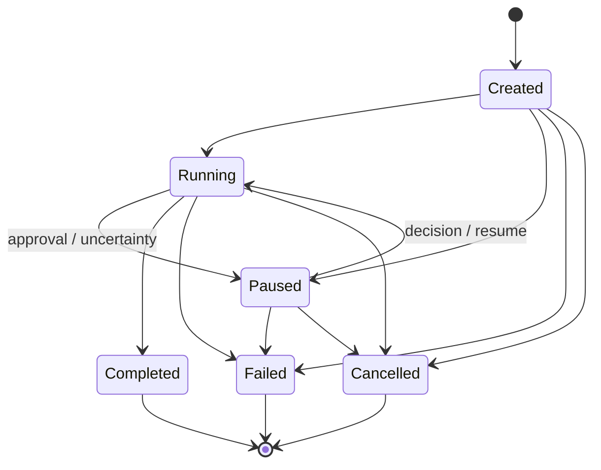
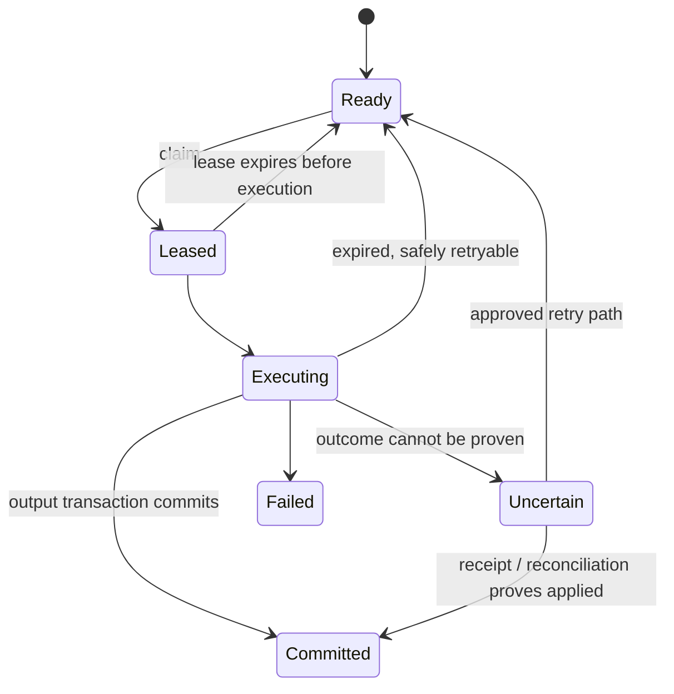

# Durability contract

Polaris makes crash behavior explicit. It records intent before execution,
associates execution with a lease, commits outputs transactionally, and resumes
only when the safety class permits. It does **not** guarantee arbitrary
exactly-once effects.

## Run and step state

Terminal run states never resume. A paused run can continue after its durable
approval/reconciliation condition is satisfied. A worker cannot take over an
active lease merely because another process asks it to resume.

## Safety classes

| Class | Meaning | Recovery after lease expiry |
|---|---|---|
| `read_only` | No externally visible mutation | Execute again; a provider request can still duplicate billing |
| `idempotent` | Repeating the same operation has the same intended effect | Retry using the operation's stable identity contract |
| `reconcilable` | A separate read can establish whether the effect happened | Reconcile first; commit observed success or request approval before retry |
| `opaque_side_effect` | No reliable receipt or reconciliation contract | Mark uncertain and stop for an explicit decision |

The built-in filesystem write is reconcilable. The shell tool is opaque.
Classification is part of a tool's contract, not a guess made after a crash.

## Crash windows

### Before a step intent is committed

There is no durable step. The deterministic planner can create it after restart.
No external operation should have started.

### After intent, before lease

The step is ready and may be claimed normally.

### While leased, before execution

Another worker waits for the lease to expire. Recovery requeues eligible work; it
does not steal an unexpired lease.

### During a model/provider request

The provider might have accepted and billed the request even if Polaris never
received or committed the response. After expiry, Polaris can retry the
read-like model step but records the abandoned call as uncertain and emits a
duplicate-billing warning. Provider billing is not exactly once.

### During a read-only tool

If no committed output exists after lease expiry, the read may run again.
External data may have changed between attempts, so "safe to retry" does not mean
"same bytes forever."

### During an idempotent effect

A retry is valid only when the target honors the same stable operation identity.
The label alone cannot turn a non-idempotent remote API into an idempotent one.

### During a reconcilable effect

Polaris calls the tool's reconciliation handler. A durable receipt or a positive
reconciliation result commits the observed effect. A negative result can create
an approval-gated retry. An inconclusive or failed reconciliation does not become
success.

### During an opaque effect

The effect may have happened. Polaris records `uncertain`, creates an
`uncertain_outcome` approval, and pauses. Restart and plain `resume` do not cross
this boundary. The operator must inspect the target system and decide whether a
retry risk is acceptable.

### After effect, before output commit

This is the central ambiguity window. Receipts and reconciliation can close it
for operations designed to expose evidence. Opaque operations cannot be made
exactly once by a local transaction, so they stop uncertain.

### After output commit

Reconstruction consumes the committed output. The step is not executed again.
Artifacts are loaded by recorded content hash.

## Recovery algorithm

At daemon startup Polaris reclaims expired leases, then considers created and
running top-level runs. It skips a run when:

- any step still holds an active lease;
- an opaque side effect is uncertain; or
- a persisted provider configuration is no longer available.

Eligible fan-out parents reconstruct child workers from journaled configuration.
Completed worker outputs and ensemble stages are reused; only missing eligible
work continues.

## Replay is not rerun

**Replay** reads committed journal records and hashed artifacts. It makes no model
or tool calls and is suitable for audit and deterministic inspection.

**Rerun** creates or executes work again against current providers and external
state. Results, cost, and effects can differ. Polaris exposes replay; creating a
new run is the explicit rerun path.

## What Polaris guarantees

- deterministic step keys prevent two committed records for the same planned
  step within a run;
- committed outputs are reused;
- leases prevent concurrent ownership while valid;
- approvals and uncertainty decisions survive restart;
- budgets are reserved before calls and settled afterward;
- append-only events and content hashes make recorded history inspectable.

## What Polaris does not guarantee

- exactly-once effects across arbitrary tools, providers, or networks;
- exactly-once provider billing;
- recovery while the journal itself is lost or corrupt;
- distributed failover across multiple journal writers or network filesystems;
- that a model's repeated response is deterministic;
- that operator approval makes a dangerous command safe.

Design integrations around idempotency keys, receipts, and reconciliation when
effects matter. Otherwise expect an uncertainty stop.
