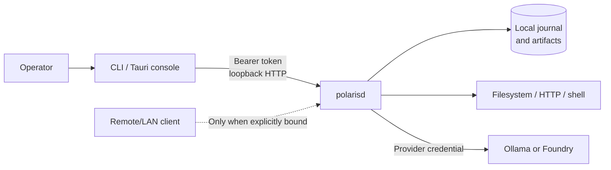

# Threat model

This document describes the intended security boundary for Polaris Agent. For
private reporting and supported versions, see the repository
[security policy](../SECURITY.md).

## Assets

- daemon bearer token and provider credentials;
- prompts, model responses, tool arguments, evidence, and artifacts;
- files reachable through configured tool roots;
- journal integrity, approval decisions, receipts, and budget records;
- the authority of the local user and approved shell commands;
- provider quota and billing.

## Trust boundaries

The daemon, journal, artifacts, and tool processes run with the host user's
authority. The bearer token authenticates API clients; it does not isolate
processes already acting as that user.

## Threats and controls

### Unauthorized daemon access

**Threat:** another host or local process submits runs, reads artifacts, or
approves effects.

**Controls:** loopback bind by default; bearer authentication for every `/v1`
route; constant-time token comparison; private setup-created token file;
non-loopback bind requires `--allow-remote` and a token.

**Residual risk:** `/health` is public but reveals only service availability.
Polaris does not provide TLS, rate limiting, multi-user authorization, or token
rotation. A compromised user account can generally read local state.

### Remote bind interception

**Threat:** credentials or run data cross an untrusted network over plain HTTP.

**Controls:** remote binding is explicit and denied without a token.

**Operator requirement:** place the daemon behind an authenticated TLS reverse
proxy and firewall/VPN, restrict source addresses, and do not expose port 8765 to
the internet. Treat every remote client as having full operator API authority.

### Prompt-driven tool abuse

**Threat:** untrusted content instructs a model to read sensitive files, write
outside the task, fetch internal services, or execute shell commands.

**Controls:** explicit filesystem roots; path resolution checks; private HTTP
access off by default; read-only tools auto-approved; mutating and opaque tools
approval-gated by default; durable record of tool arguments and decisions.

**Residual risk:** a permitted root may contain secrets. An approved shell command
inherits broad user authority and can escape filesystem-root semantics. Approval
is a human checkpoint, not validation of command safety.

### SSRF and network exfiltration

**Threat:** HTTP/search tools reach loopback, link-local, private, or credentialed
URLs.

**Controls:** endpoints reject embedded credentials and fragments; private HTTP
is disabled unless explicitly enabled; offline configuration restricts provider
hosts.

**Residual risk:** DNS and network topology can change, and configuration policy
is not an operating-system sandbox. Use egress firewall policy for high-assurance
offline operation.

### Secret leakage

**Threat:** API keys or bearer tokens enter JSON, logs, backups, screenshots, or
bug reports.

**Controls:** provider configuration names environment variables instead of
storing values; authentication headers are rejected in config; token files use
private permissions; encrypted backups omit credentials and the API token.

**Operator requirement:** keep secrets in a credential manager/environment,
restrict state-directory permissions, and apply the
[redaction checklist](../SECURITY.md#redaction-checklist). Model output and
evidence can still reproduce secrets found in input files.

### Recovery duplication

**Threat:** a crash occurs after an external effect or provider charge but before
the local commit, and retry duplicates it.

**Controls:** leases, deterministic step keys, receipts, safety classes,
reconciliation handlers, durable approvals, and uncertainty stops.

**Residual risk:** provider requests can be billed twice. Arbitrary shell/remote
effects have no exactly-once guarantee. Approving an uncertain retry accepts this
risk.

### Journal or artifact tampering

**Threat:** local malware or another process edits/deletes state, fabricates
approvals, or replaces artifacts.

**Controls:** SQLite constraints and append-only event triggers; full synchronous
commits; content hashes for artifacts; private directories.

**Residual risk:** hashes detect accidental/subsequent mismatch but do not provide
an external signature or transparency log. Anyone with write authority over both
journal and artifacts can rewrite history. Back up encrypted exports separately.

### Supply-chain compromise

**Threat:** a dependency, action, package, or release artifact is replaced.

**Controls:** lockfiles, Dependabot, CodeQL/dependency review, CI builds,
checksums, and release provenance attestations.

**Residual risk:** this alpha does not yet promise reproducible builds or signed
macOS distribution.

### Resource exhaustion and cost

**Threat:** large prompts, K workers, loops, or routed models consume memory,
time, tokens, or budget.

**Controls:** call/token/micro-USD/wall limits, budget reservations, maximum
iterations, no-progress detection, and fan-out capped at eight workers.

**Residual risk:** local models can exhaust host RAM; provider usage measurement
and price estimation depend on upstream responses/configuration.

## Deployment guidance

1. Use a dedicated OS account and a minimal workspace root.
2. Keep state and SQLite on local encrypted storage.
3. Leave the daemon on loopback unless remote operation is essential.
4. Keep shell approval enabled and inspect uncertainty before retrying.
5. Use an egress firewall for a true no-cloud profile.
6. Redact `doctor`, timelines, artifacts, and screenshots before sharing.
7. Test restore and crash recovery with disposable data before production use.
